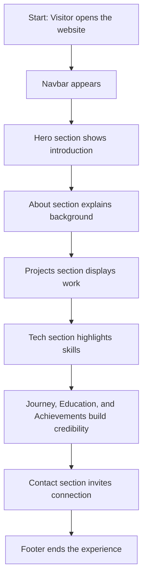

# Welcome to My Portfolio Website

This project is a modern personal portfolio website built with React and Vite. It is designed to showcase my skills, projects, certifications, education, and contact information in a clean and attractive way.

The website is not just a static page. It is a structured digital experience that helps visitors quickly understand who I am, what I build, and how to connect with me.

---

## What this project does

This portfolio website acts like a digital introduction card for me. It includes:

- a welcoming hero section
- an about section with my background
- a projects section
- a technology stack section
- my journey and achievements
- education details
- contact information
- a downloadable resume

In simple words, this app helps people see my professional identity in one place.

---

## Main idea of the project

The goal of this website is to make my profile easy to understand and visually appealing.

Instead of using a traditional resume only, this project presents my story in a more interactive and modern format.

Visitors can:

- learn about me quickly
- browse my work
- understand my skills
- contact me easily

---

## Simple component map

Here is a simple map of how the app is organized:

```text
User opens the website
        ↓
Navbar loads first
        ↓
Hero section welcomes the visitor
        ↓
About section introduces the person
        ↓
Projects section shows work
        ↓
Tech section shows skills
        ↓
Journey / Education / Achievements sections build trust
        ↓
Contact section gives a way to connect
        ↓
Footer closes the experience
```

---

## Flowchart of the website

This flowchart shows the main flow of the website in a more visual way:



---

## How the website works

When a visitor opens the app:

1. The main app loads all the major sections.
2. The navbar helps users move quickly between sections.
3. The hero section gives the first impression.
4. The about section explains who I am.
5. The project section shows what I have built.
6. The skills section shows my technical strength.
7. The education and journey sections add credibility.
8. The contact section makes it easy to reach out.

This structure makes the experience smooth and easy to follow.

---

## Project structure

The project is organized into a few important folders:

```text
src/
├── components/        # all page sections such as Hero, About, Projects, Contact
├── assets/            # images and other static files
├── App.jsx            # main app file that brings all sections together
├── main.jsx           # app entry point
└── index.css          # global styles
```

### What each part does

- components/: contains reusable and section-based React components
- assets/: holds images used in the website
- App.jsx: connects all the sections and displays them together
- main.jsx: starts the React application
- index.css: defines the global styling for the website

---

## Technologies used

This project uses:

- React for building the user interface
- Vite for fast development and build tools
- CSS for styling and visual design
- Bootstrap and Bootstrap Icons for UI enhancements

These tools make the site modern, fast, and easy to maintain.

---

## How to run the project locally

Follow these steps:

1. Open the project folder in your terminal.
2. Install the dependencies:

```bash
npm install
```

3. Start the development server:

```bash
npm run dev
```

4. Open the local URL shown in the terminal in your browser.

---

## Extra feature included

The website also includes a visual resume file in the public folder. This gives visitors a polished downloadable version of my resume.

---

## Why this project is useful

This project is useful because it combines:

- personal branding
- portfolio presentation
- professional storytelling
- clear structure
- modern design

It helps turn a simple resume into a professional online experience.

---

## Summary

This project is a clean and modern portfolio website that presents my identity in an attractive and easy-to-understand way. It is designed to be simple for visitors, powerful for showcasing my work, and effective for professional networking.
